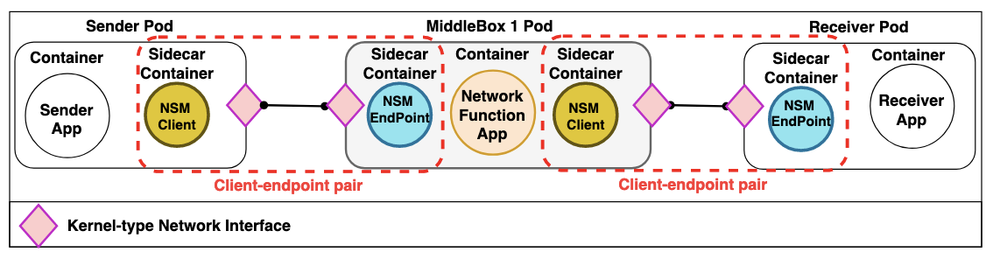
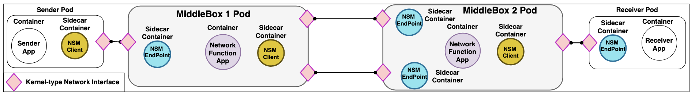

# SDN-Based Service Function Chaining in Kubernetes Using Network Service Mesh With Kernel-Type Network Interfaces for MiddleBoxes for Industrial IoT

### Requirments to deploy the packet forwarder
* [Sysrepo python](https://github.com/sysrepo/sysrepo-python)

* [Sysrepo](https://github.com/sysrepo/sysrepo)

* [libyang](https://github.com/CESNET/libyang)

* [libnetconf](https://github.com/CESNET/libnetconf)

* Python 3.10
  * scapy lib
  * sysrepo python lib
  * libyang python lib

* Any SDN controller that supports NetConf 


### Run Packet Forwarder

* Add sfc-route YANG to the Sysrepo
* Import the simpleRoute.xml to the Sysrepo
  * Modify the protocol if needed
  * Modify the network interfaces' name if needed
* Modify the network interfaces' name in the code (if needed) and run the main.py (in the packet_forwarder folder)
  * Python3.10 main.py


### NSM_example folder

This folder provides simple SFC scenarios with Kernel-type network interfaces for middleboxes using NSM.
These scenarios may utilize a packet forwarder to ensure end-to-end connectivity between the 
sender and receiver. However, in the absence of a packet forwarder or any similar application, 
the internal traffic routing within the middleboxes must be managed manually.

### Steps to deploy examples
* Deploy a Kubernetes cluster (v1.28 or higher)
* Deploy Flannel CNI (https://github.com/flannel-io/flannel)
* Deploy Network Service Mesh (NSM) v1.11 
  * ```git clone --branch v1.11.0 https://github.com/networkservicemesh/deployments-k8s.git```
  * ```cd deployments-k8s```
  * ```nano apps/admission-webhook-k8s/admission-webhook.yaml```
  * scroll down to the ENV variable "name: NSM_ENVS" 
    Change the value from "NSM_LOG_LEVEL=INFO" to "NSM_LOG_LEVEL=INFO,NSM_LIVENESSCHECKENABLED=false"
  * ```kubectl apply -k https://github.com/networkservicemesh/deployments-k8s/examples/spire/single_cluster?ref=v1.11.0```
  * ```kubectl apply -f https://raw.githubusercontent.com/networkservicemesh/deployments-k8s/v1.11.1/examples/spire/single_cluster/clusterspiffeid-template.yaml```
  * ```cd examples/basic/```
  * ```kubectl apply -k ./```
* Download and move the NSM_example folder to the Kubernetes master node
  * ```cd 1MiddleBox/``` or ```cd 2MiddleBox/ ```
  * ```kubectl apply -k ./```
* Make sure to add routing in the sender and receiver
  * ```apt install iproute2 -y```
  * ```ethtool -K INTERFACE_NAME tx off```
  * ```ip route add DESTINATION_IP via INTERFACE_IP dev INTERFACE_NAME```
    * Example ```ip route add 172.16.20.0/24 via 172.16.1.101 dev nsm-1```

### Useful commands
* Delete NSM
  * ```WH=$(kubectl get pods -l app=admission-webhook-k8s -n nsm-system --template '{{range .items}}{{.metadata.name}}{{"\n"}}{{end}}')```
  * ```kubectl delete mutatingwebhookconfiguration ${WH}```
  * ```kubectl delete ns nsm-system```
* Delete the deployed SFC scenario
  * ```kubectl delete ns ns-carleton-services```
* Execute commands inside the middleboxes 
  * ```kubectl exec -it -n ns-carleton-services  POD_NAME --container CONTAINER_NAME -- /bin/bash```
* Dump NSM and the deployed SFC scenario logs
  * ```kubectl cluster-info dump -n nsm-system --output-directory nsm-dump```
  * ```kubectl cluster-info dump -n ns-carleton-services --output-directory nsm-dump```

### Example scenario

#### 1Middlebox



#### 2Middleboxes with multiple Kernel-type interfaces 




## Folder structure
    .
    ├── NSM_examples         # SFC examples with kernel-type interfaces using NSM
    │   ├── 1middlebox       # A simple SFC scenario with 1 middlebox 
    │   └── 2middlebox       # A simple SFC scenario with 2 middleboxes with multipl Kernel-type NICs
    ├── pakcet_forwarder      
    │   ├── main.py          # Packet forwarder code
    │   ├── sfc-route.yang   # Yang model for packet forwarder
    │   └── simpleRoute.xml  # Simple XML for the packet forwarder Yang model
    └── ReadMe.md
